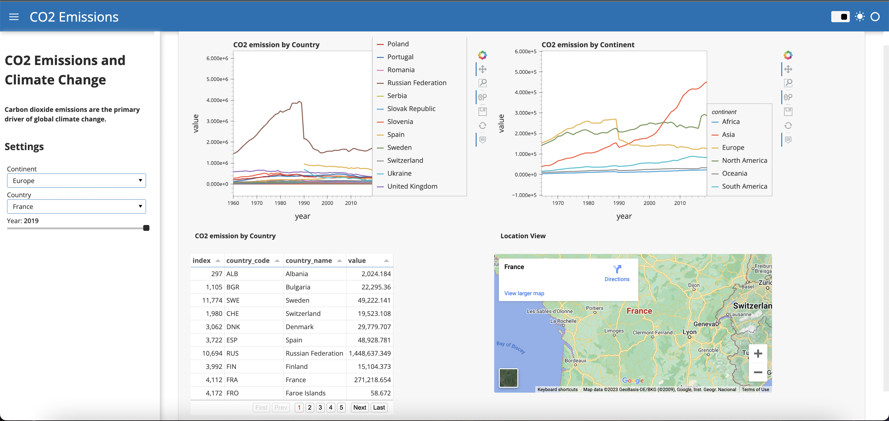

# python_dashboard_co2_Emissions

## Python Interactive Dashboard using Panel

The purpose of the project was to create a data dashboard using Panel to visualise CO2 Emmisions data from the year 1960 to 2019.

Dataset: https://www.kaggle.com/datasets/ulrikthygepedersen/co2-emissions-by-country

## Overview of Dashboard
